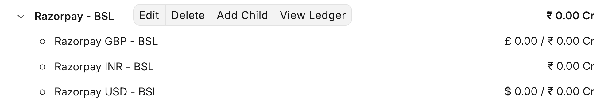

## About our business

We are a bunch of problem solvers providing software services in the Frappe ecosystem. We have been using ERPNext since Day 1 (because, duh?) and Shivam has been our ERPNext guy managing accounting and admin stuff.

As we grew, the book-keeping process (mostly data entry 🥲) quickly became tedious and boring. When Shivam decided to transition into Frappe development (sadly, he still hasn't been able to, ERPNext does not leave him), we hired our friend to do it for us. We trained him on ERPNext. He left after a month and claimed it to be a boring thing too.

This is when I decided to take matters in my own hands.

## Started as a server script

The first thing that seemed worth automating was the repeatative sales invoice generation at the start of every month. So we started with a simple and dumb scheduled server script (wrote it by hand, pre-Agentic AI era), which looped through a list of hardcoded customers and generated a Sales Invoice document for each.

* But who writes code by hand these days plus things change a lot
* Wanted to do more

## The Setup

OpenClaw needs a computer to run on, and given its always on nature, it made sense to host it on a cloud VM (and not buy a mac mini iykyk 😂). Although [OpenClaw setup](https://docs.openclaw.ai/install) is straight-forward and wizard based I did not want to do it manually. Hence, I provisioned a VM on Hetzner (4GB RAM/2 vCPU if curious), put my SSH keys, and fired up Claude Code to help me through it. It then prepared the machine with firewall, and stuff.

The next importance piece of the setup wizard is to configure a chat channel through which you will interact with the OpenClaw agent. We choose Telegram because that is where we have our team communications. You can connect WhatsApp, Slack, and many more.

## Onboarding

Once the initial setup is done, rest of the things can now be done by chatting with the agent. I onboarded Donna as if onboarding an actual employee on our team:

1. Setup a dedicated email account on our Google workspace, donna@bwh.tech.  
2. Create a user on our ERPNext instance with necessary roles.

## Training

This is the most important piece so we will spend some time here. After some basic instructions like.

* SOUL.md
* SOPs (about the company, point to company master etc.)
* Monitoring what it learns (push to github at night, pull locally and view in obsedian)

### Email SOP

This was the second most important communication channel integration (using the `gog` CLI). This is how Donna will communicate with the external world. And since this involved external parties: customers, suppliers, and more, this has to be handeled with care. I asked Donna to setup an `EMAIL.md` file + agent skill that would be invoked for anything related to emails.

The first instruction was to **take an approval** from me before replying to anyone except the team (`@bwh.tech`). The second was to always have a **byline that makes sure people know that they are interacting with an AI assistant** and what to do if it makes mistakes.

## First Automation

In order to run a company, we need certain subscriptions (and ad-hoc purchases) to keep things running smoothly, for example: Google Workspace (we shall replace with Frappe Suite once ready!), [Frappe Cloud](https://cloud.frappe.io), Zoom etc. 

## Tackling Piece by Piece

* Monthly Sales invoices
* Processing statements (reconciliation)

## Bringing Determinism to Probablistic Machines

If you give a certain prompt to an agent (LLM), it might not give you the same output always even if the prompt remains same, because LLMs are probabilistic machines. But we need determinism in how things should be takled: sending of sales invoice on email, creation of documents in ERPNext, etc.

## Important Trick

LLMs are also good at reading code, so why not give them the codebases of our ERPNext and India Compliance apps? Open Source FTW!

## Surprise

## Use-case 2: Razorpay Settlements

We use Razorpay as our online payment gateway. It is used by [BWH School](https://buildwithhussain.com/school) and also by few of our foriegn services clients.

Here is how the flow looks like:

<TODO: Diagram>

Customer pays Razorpay, it settles the amount to our bank in some frequency after deducting gateway charges and currency conversions. For this to be nicely entered into ERPNext, we need to do multiple entries, even more if currency conversion is involved. And data comes from Razorpay dashboard (manually checked) regarding the charges and taxes on those charges.

Before LLMs, I would have had to write an integration that would pull in data from Razorpay and a complicated script that would look at different scenarios of currency and whatnot and then pick proper accounts and stuff. It would have taken me a good amount of time, but we have agents now, right?

The goal was simple, Razorpay accounts should be 0 at the end of the day:

And Donna, worked through this as I chatted about the process. Without even me mentioning it decided to verify via General Ledger as she perfected the process and ultimately created a script.

I prompted my way through it, and then at the end of it, the result was a nice script that talks to the Razorpay API, gets the settlements every day, processes them, and marks payment entries properly for existing sales invoices. At the end of the day all accounts are settled nicely:

Yay!

> BTW, If you also want to setup your very own "Donna" for your business, we can help you out, drop me an email at hussain@bwh.tech.

## Misc

* Gameplan
* Video Planning
* Video Editing

## Conclusion & Future Ideas

* Replace with Hermes
* 
